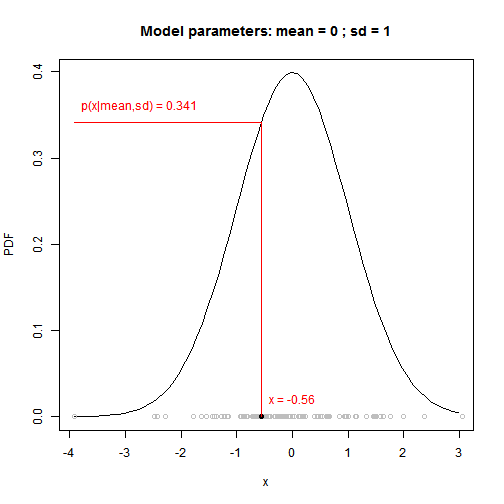

Univariate Normal Model
========================================================

**Simulation of data in R is easy!** The R functions ```rnorm()```, ```rpois()```, ```runif()```, ```rbinom()```, ```rgamma()```, ```rbeta()``` etc. are exactly for that.

We will generate some Normally-distributed data:

```r
my.mean <- 0
my.sd <- 1
my.n <- 100
x <- rnorm(n = my.n, mean = my.mean, sd = my.sd)
x <- sort(x)
x
```

```
##   [1] -3.916418 -2.482945 -2.414422 -2.281430 -1.781853 -1.634923 -1.548759
##   [8] -1.432588 -1.399622 -1.355268 -1.354296 -1.267450 -1.218600 -1.157303
##  [15] -1.152283 -0.929930 -0.905597 -0.879096 -0.860917 -0.832781 -0.817011
##  [22] -0.802382 -0.715993 -0.698022 -0.678420 -0.675179 -0.664158 -0.639509
##  [29] -0.588518 -0.560476 -0.540123 -0.534239 -0.520529 -0.471996 -0.427195
##  [36] -0.420220 -0.417014 -0.415396 -0.410394 -0.397998 -0.325056 -0.299200
##  [43] -0.294751 -0.268714 -0.219133 -0.217813 -0.211846 -0.195755 -0.170432
##  [50] -0.161948 -0.157000 -0.113988 -0.108891 -0.063836 -0.052527 -0.006385
##  [57]  0.037360  0.045570  0.115290  0.133155  0.145331  0.182334  0.187330
##  [64]  0.193656  0.196420  0.204647  0.244757  0.398565  0.443770  0.450654
##  [71]  0.503619  0.537002  0.612920  0.629975  0.641650  0.667960  0.838689
##  [78]  0.856065  0.928716  0.932893  0.950009  0.964289  0.974006  0.974121
##  [85]  1.004798  1.132962  1.152657  1.326811  1.331624  1.463424  1.476194
##  [92]  1.494242  1.518013  1.589052  1.590584  1.631632  1.754993  1.988363
##  [99]  2.382813  3.059123
```


Plotting the data and PDF that generated them:

```r
 # empirical histogram
  hist(x, freq=FALSE, ylab="Density")
 # adding the points to the bottom  
  points(x, rep(0, times=my.n))
 
 # plotting the probability density function (PDF)
 # used to generate the data
   x2 <- seq(from=min(x), to=max(x), by=0.1)
 # calculating the probability density   
   y <- dnorm(x2, mean=my.mean, sd=my.sd)
  
   lines(x2, y)
```

 


********************************************************************************


Likelihood - single data point
------------------------------

The *likelihood function* is the density evaluated at the data $x_1$, ... ,$x_n$, viewed as a function of model parameters ($\mu$ and $\sigma$ in case of the Normal model). We write it as $L(\mu, \sigma | x) = p(x | \mu, \sigma)$.  

**Calculation of likelihood in R is easy!** The R functions ```dnorm()```, ```dpois()```, ```dunif()```, ```dbinom()```, ```dgamma()```, ```dbeta()``` etc. are exactly for that!

Example: What is the probability density at the specific value of the data, given the $Normal(\mu, \sigma)$ model?


```r
# this is the data point that we will examine:
one.data.point <- x[1]

# this is how you calculate the likelihood for the data point:
L <- dnorm(x = one.data.point, mean = my.mean, sd = my.sd)
L
```

```
## [1] 0.0001863
```


```r
likelihood.plotter <- function(x, point.index, mean, sd)
{
  x.axis <- seq(from=min(x), to=max(x), by=0.1)
  y.axis <- dnorm(x.axis, mean=mean, sd=sd)
  point.value <- round( x[point.index], 2)
  
  L <-dnorm(point.value, mean=mean, sd=sd)
  L <- round(L, 4)
  
  # plotting  
  title <- paste("Model parameters: mean =", mean, "; sd =", sd)
  plot(x.axis, y.axis, 
       ylim=c(0,max(y.axis)), 
       type="l", xlab="x", ylab="PDF",
       main=title)
  points(x, rep(0, times=length(x)), col="grey")
  points(point.value, 0, pch=19)
  lines(c(point.value,point.value), c(0, L), col="red")
  lines(c(min(x), point.value), c(L, L), col="red")
  text(x=min(x), y=L+0.02, pos=4,
       labels=paste("p(x|mean,sd) =",L), col="red")
  text(x=point.value+0.02, y=0.02, pos=4,
       labels=paste("x =",point.value), col="red")
} 
```


Let's play around with the function a bit. Try to change the paramters and see
what it does:

```r
likelihood.plotter(x = x, point.index = 30, mean = 0, sd = 1)
```

 


********************************************************************************

Likelihood - whole dataset
--------------------------

Basic probability theory tells us that:

$$P(A \cap B) = P(A) \times P(B|A) = P(B) \times P(A|B) $$

The problem is that $$ P( A \cap B \cap C \cap D )$$
can be almost impossible to calculate,

**with the exception of**
 A and B being independent! Then: 
$$P(A \cap B) = P(A) \times P(B) $$
and hence
$$ P( A \cap B \cap C \cap D ) = P(A) \times P(B) \times P(C) \times P(D)$$

It follows that it is useful to subject *probability density $p()$* to the same rules as *probability $P()$*. Hence, we can calculate the likelihood for the whole dataset as a product of likelihoods for all data points!


```r
x
```

```
##   [1] -3.916418 -2.482945 -2.414422 -2.281430 -1.781853 -1.634923 -1.548759
##   [8] -1.432588 -1.399622 -1.355268 -1.354296 -1.267450 -1.218600 -1.157303
##  [15] -1.152283 -0.929930 -0.905597 -0.879096 -0.860917 -0.832781 -0.817011
##  [22] -0.802382 -0.715993 -0.698022 -0.678420 -0.675179 -0.664158 -0.639509
##  [29] -0.588518 -0.560476 -0.540123 -0.534239 -0.520529 -0.471996 -0.427195
##  [36] -0.420220 -0.417014 -0.415396 -0.410394 -0.397998 -0.325056 -0.299200
##  [43] -0.294751 -0.268714 -0.219133 -0.217813 -0.211846 -0.195755 -0.170432
##  [50] -0.161948 -0.157000 -0.113988 -0.108891 -0.063836 -0.052527 -0.006385
##  [57]  0.037360  0.045570  0.115290  0.133155  0.145331  0.182334  0.187330
##  [64]  0.193656  0.196420  0.204647  0.244757  0.398565  0.443770  0.450654
##  [71]  0.503619  0.537002  0.612920  0.629975  0.641650  0.667960  0.838689
##  [78]  0.856065  0.928716  0.932893  0.950009  0.964289  0.974006  0.974121
##  [85]  1.004798  1.132962  1.152657  1.326811  1.331624  1.463424  1.476194
##  [92]  1.494242  1.518013  1.589052  1.590584  1.631632  1.754993  1.988363
##  [99]  2.382813  3.059123
```

```r

L <- dnorm(x = x, mean = my.mean, sd = my.sd)
L
```

```
##   [1] 0.0001863 0.0182892 0.0216304 0.0295580 0.0815582 0.1048290 0.1202400
##   [8] 0.1429739 0.1498068 0.1592446 0.1594545 0.1786810 0.1898669 0.2042086
##  [15] 0.2053959 0.2588974 0.2647441 0.2710794 0.2754009 0.2820417 0.2857347
##  [22] 0.2891392 0.3087383 0.3126860 0.3169328 0.3176287 0.3199817 0.3251644
##  [29] 0.3355061 0.3409549 0.3447951 0.3458866 0.3483966 0.3568896 0.3641512
##  [36] 0.3652289 0.3657194 0.3659658 0.3667224 0.3685645 0.3784129 0.3814792
##  [43] 0.3819836 0.3847959 0.3894779 0.3895902 0.3900900 0.3913713 0.3931901
##  [50] 0.3937449 0.3940557 0.3963589 0.3965841 0.3981303 0.3983923 0.3989341
##  [57] 0.3986640 0.3985283 0.3962997 0.3954212 0.3947514 0.3923655 0.3920034
##  [64] 0.3915313 0.3913203 0.3906752 0.3871700 0.3684812 0.3615321 0.3604207
##  [71] 0.3514266 0.3453751 0.3306238 0.3271382 0.3247188 0.3191723 0.2806525
##  [78] 0.2765503 0.2591897 0.2581839 0.2540568 0.2506080 0.2482592 0.2482314
##  [85] 0.2408098 0.2099807 0.2053073 0.1654391 0.1643841 0.1367305 0.1341880
##  [92] 0.1306389 0.1260445 0.1128742 0.1125995 0.1053939 0.0855256 0.0552586
##  [99] 0.0233342 0.0037051
```

```r

prod(L)
```

```
## [1] 5.538e-67
```

This is a ridiculously small number!
Which is why we have the **Negative Log Likelihood**, also known as the **deviance**:

```r
-sum(log(L))
```

```
## [1] 152.6
```


We can encapsulate it into a single function:

```r
deviance.function <- function(x, mean, sd) {
    LL <- dnorm(x = x, mean = mean, sd = sd, log = TRUE)  # note the log!!!
    deviance <- -sum(LL)
    return(deviance)
}

# it's a function of model parameters, so try to play around with different
# paramter values
deviance.function(x, mean = 0, sd = 1)
```

```
## [1] 152.6
```


Deviance (negative log-likelihood) can be then minimized (likelihood is maximized) in order to find the most likely model parameters - these are the **Maximum Likelihood Estimators** of model parameters.

One can use ```optim()``` for automatic likelihood optimization.
